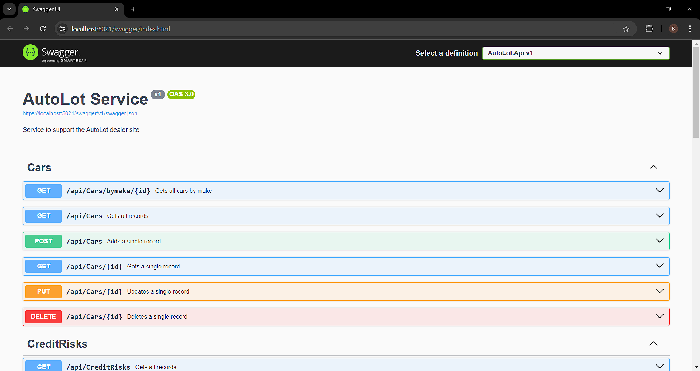
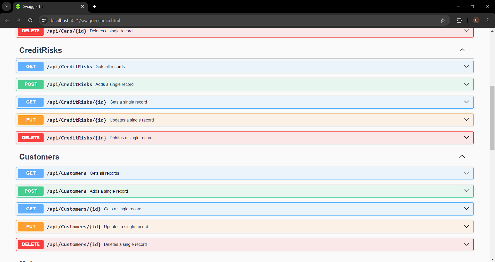
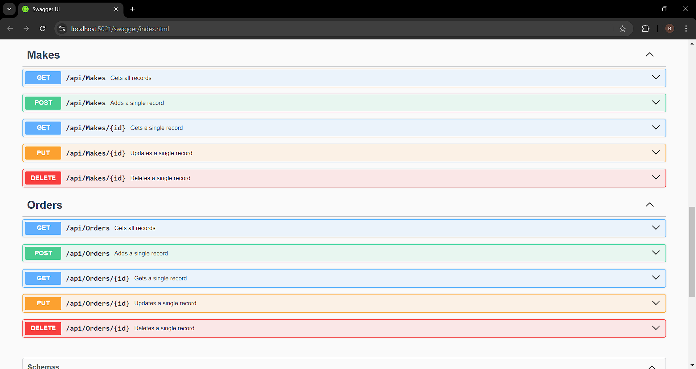
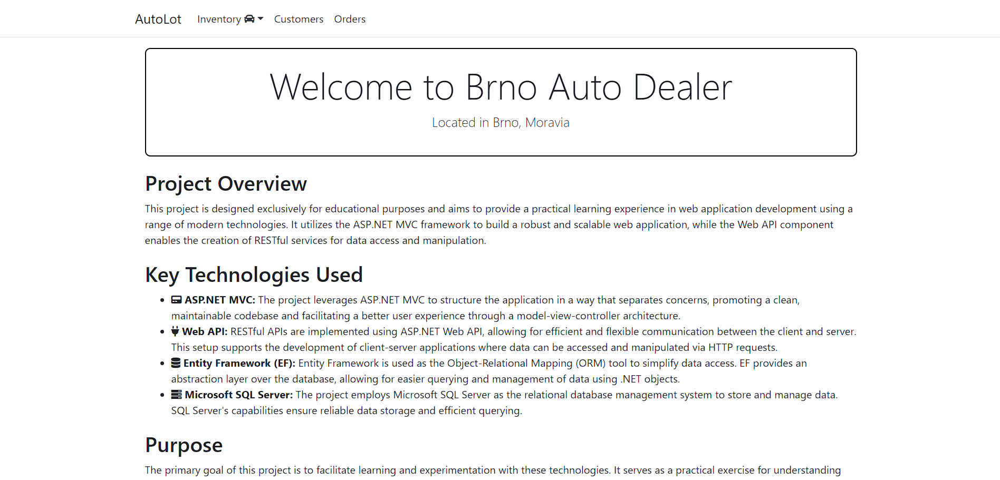
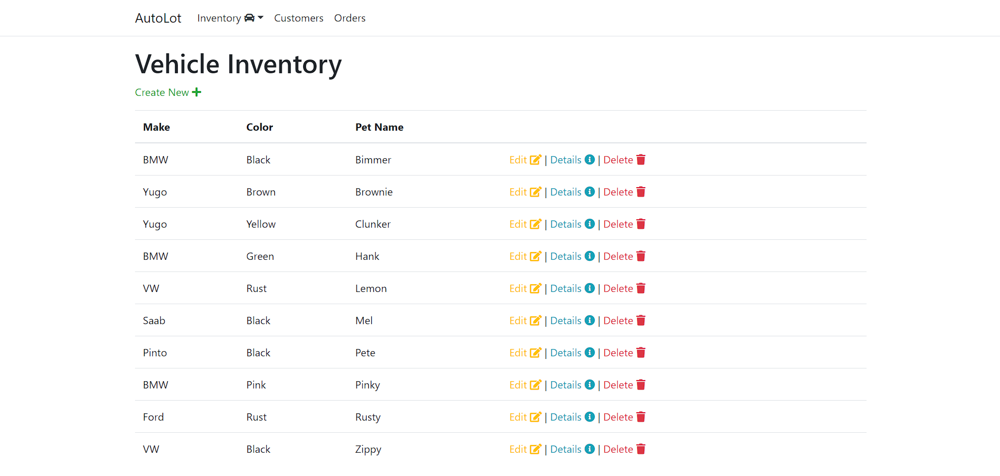
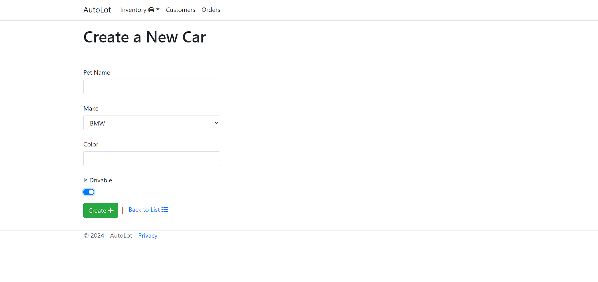
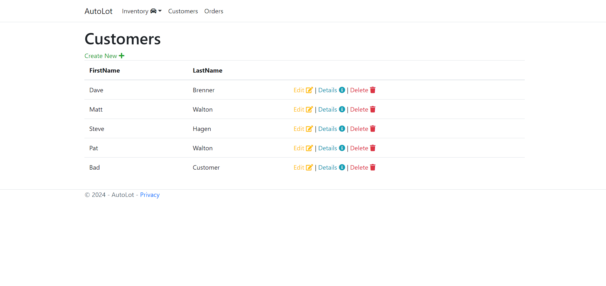
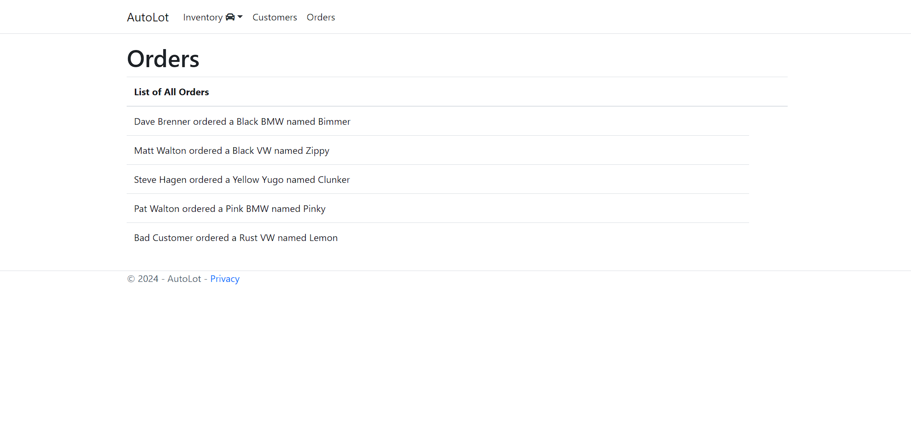

# Application Development Summary

## Purpose
This application is designed for **educational purposes**, focusing on demonstrating best practices in software development. It serves as a practical example for building a complete application from scratch using the latest technologies and frameworks.

## Technologies in Use
- **Entity Framework**
- **XUnit**
- **ASP.NET Core MVC**
- Other related technologies

## Completed Components
- **AutoLot.Dal**: Data Access Layer
- **AutoLot.Dal.Tests**: Unit Testing for DAL
- **AutoLot.Models**: Data Models
- **AutoLot.Api**: RESTful API
- **AutoLot.MVC**: Frontend (Blazor)

### Included Features
- **Migrations**: Managing schema changes with database migrations.
- **Exceptions**: Custom exception handling for robust error management.
- **Initialization**: Database initialization and seeding for setup.
- **Repos**: Repository pattern implementation for organized data access.
- **Entities**: Domain entities representing the database structure.
- **Integration Tests**: Tests covering the integration between components.
- **ViewModels**: Data transfer objects for communication between controller and views.
- **SeliLog**: Enhanced logging using SeliLog for better diagnostics.
- **ASP.NET Core MVC/Web API**: Development of web and API interfaces.
- **Controllers**: MVC controllers handling requests and business logic.
- **Filters**: Custom filters for request and response management.
- **Models**: Development and refinement of data models.
- **ViewComponents**: Reusable view logic components.
- **Views**: Creation of user interfaces for the MVC application.
- **AutoLot.Services**: Service layer for business logic implementation.
- **ApiWrapper**: Wrapping external API calls within the application.
- **Logging**: Advanced logging mechanisms for detailed diagnostics.
- **TagHelpers**: Custom tag helpers for improved view rendering (Ready only for Car).

## Remaining Tasks
- [ ] ...

## Screenshots

**API:**
- 
- 
- 

**Frontend:**
- 
- 
- 
- 
- 
